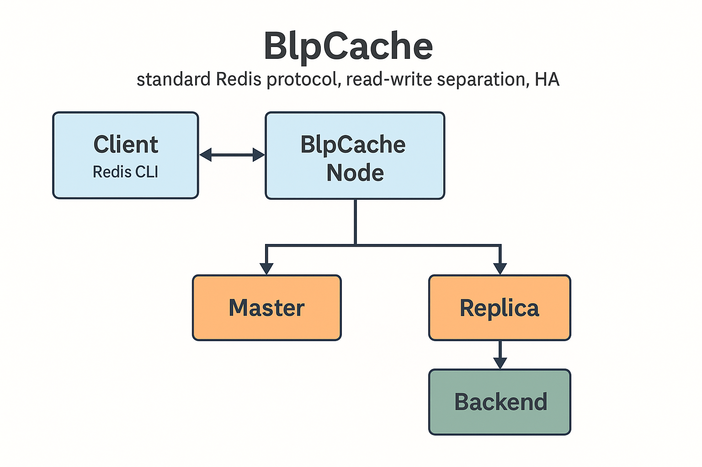

# BlpCache

**BlpCache** 是一款轻量级的分布式缓存系统，支持 **标准 Redis 协议**、**读写分离** 以及 **高可用（HA）模式**。旨在为高性能、高并发的业务场景提供简单易用、稳定可靠的缓存解决方案。

BlpCache 兼容现有 Redis 客户端与生态系统，用户可以无需修改应用代码，直接接入使用。

---

## 功能特点
- ⚡ 轻量级，易部署，快速上线
- 📡 兼容标准 Redis 协议
- 🔄 支持读写分离架构
- 🛡️ 高可用（HA）自动切换
- 🚀 高并发读写性能优化
- 🧩 灵活的模块化与插件扩展机制

---

## 快速开始

### 1. 克隆代码仓库
```bash
git clone https://github.com/fkzhao/BlpCache.git
cd BlpCache
````

### 2. 编译项目

```bash
mkdir build && cd build
cmake ..
make -j4
```

### 3. 启动 BlpCache 服务

```bash
./blpCache --config ../config/blp.conf
```

### 4. 使用 Redis 客户端连接测试

```bash
# 使用 redis-cli 进行简单读写操作
redis-cli -h 127.0.0.1 -p 6379 set key1 value1
redis-cli -h 127.0.0.1 -p 6379 get key1
```

---

## 依赖环境

* CMake >= 3.15
* GCC >= 9.0 / Clang >= 10.0
* LevelDB >= 1.22
* BRPC >= 1.5.0
* gflags / glog
* protobuf >= 3.15
* pthread (POSIX 线程库)

### 依赖安装示例（以 Debian/Ubuntu 为例）

```bash
sudo apt update
sudo apt install -y build-essential cmake libgflags-dev libprotobuf-dev protobuf-compiler libgoogle-glog-dev libsnappy-dev
# BRPC 和 LevelDB 的安装请参考 docs/install.md
```

---

## 配置文件说明

BlpCache 的所有配置集中在 `config/blpcache.yaml` 文件中，主要包含以下部分：

* **network:** 服务监听端口与 Redis 协议配置
* **storage:** 后端存储（如 LevelDB 路径）配置
* **replication:** 主从同步与复制配置
* **ha\_mode:** 高可用模式相关参数

详细配置项与说明请参考 [配置文档](docs/configuration.md)。

---

## 系统架构

```
+-------------+       +-----------------+       +-------------+
|   客户端    | <---> |  BlpCache 节点  | <---> |   存储后端   |
| (Redis CLI) |       | (Master/Replica)|       |  (LevelDB)   |
+-------------+       +-----------------+       +-------------+
                          |       |
                          |  +---------+
                          +->|  主节点  |
                          |  +---------+
                          |  +---------+
                          +->|  副本节点|
                             +---------+
```

---

## 测试

```bash
# 运行单元测试
make test

# 运行集成测试（需要 Docker 环境）
cd tests/integration
docker-compose up --build
```

---

## 贡献指南

欢迎通过 Pull Request 和 Issue 与我们一起完善 BlpCache！
贡献步骤：

1. Fork 本项目
2. 新建特性分支 (`git checkout -b feature/xxx`)
3. 提交修改 (`git commit -m '添加新功能 xxx'`)
4. 推送到分支 (`git push origin feature/xxx`)
5. 创建 Pull Request

详细贡献规范请参考 [CONTRIBUTING.md](CONTRIBUTING.md)

---

## 开源许可证

BlpCache 基于 MIT License 开源，详细内容请查阅 [LICENSE](LICENSE)。

